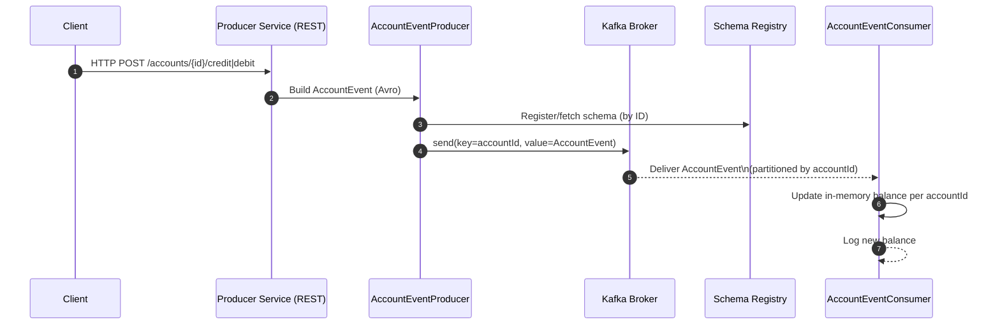

# Kafka Avro POC — Spring Boot Producer & Consumer with Schema Registry

This project is a **minimal end-to-end example** of:

- Spring Boot microservice exposing simple **REST endpoints**
- Producing and consuming **Kafka messages using Avro**
- Integrating with **Confluent Schema Registry**
- Preserving **ordering per account** using the Kafka message key

Everything runs **locally** using `docker-compose` (Kafka + Schema Registry) and a single Spring Boot app that contains both the producer and consumer.

---

## 🔍 High-Level Flow

1. A client calls the REST API (e.g. `POST /accounts/ACC123/credit?amount=100`).
2. The Spring Boot controller builds an **Avro `AccountEvent`** object.
3. The producer uses **KafkaAvroSerializer** to:
    - register or fetch the schema in **Schema Registry**
    - send the message to Kafka topic `account-events`
4. Kafka routes the message to a **partition based on `accountId`**.
5. The `@KafkaListener` consumer reads `AccountEvent` from Kafka, in order per `accountId`.
6. The consumer updates an **in-memory balance map** and logs the new balance.

---

## 🧩 Sequence Diagram



Project Structure (simplified)
```
.
├── build.gradle.kts
├── docker-compose.yml
├── src
│   └── main
│       ├── avro
│       │   └── account-event.avsc
│       ├── java
│       │   └── com/viana/poc
│       │       ├── KafkaAvroPocApplication.java
│       │       ├── config
│       │       │   └── KafkaProducerConfig.java
│       │       ├── service
│       │       │   ├── AccountEventProducer.java
│       │       │   └── AccountEventConsumer.java
│       │       └── controller
│       │           └── AccountController.java
│       └── resources
│           └── application.yml
└── README.md

```
## Running the stack

### 1. Start Kafka + Schema Registry

```bash
docker-compose up -d
# services: zookeeper, kafka, schema-registry
docker ps   # verify containers are running
```
## Run the Spring Boot app
```
./gradlew bootRun
```
The app will start on http://localhost:8080.


## Test the endpoints

Send events (Postman or curl):
```
# CREDIT
curl -X POST "http://localhost:8080/accounts/ACC123/credit?amount=100"

# DEBIT
curl -X POST "http://localhost:8080/accounts/ACC123/debit?amount=50"
```

Each call produces an Avro AccountEvent to the account-events topic,
and the consumer logs the new balance, e.g.:

Event CREDIT for account ACC123 ? new balance = 100.00